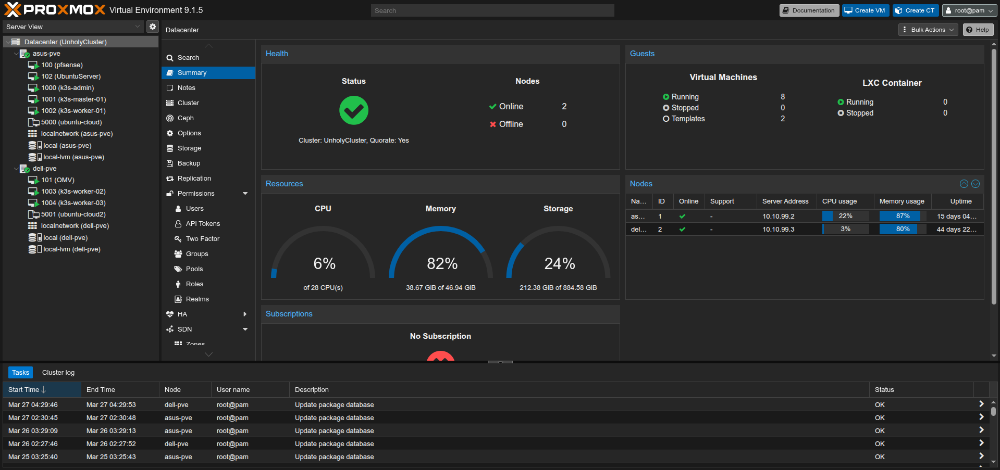
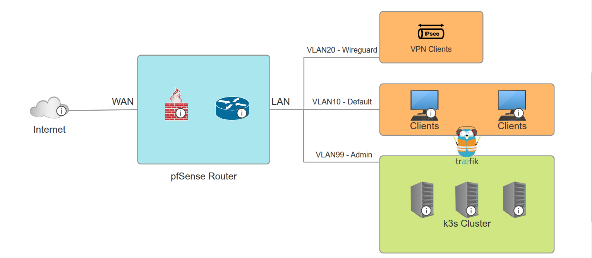
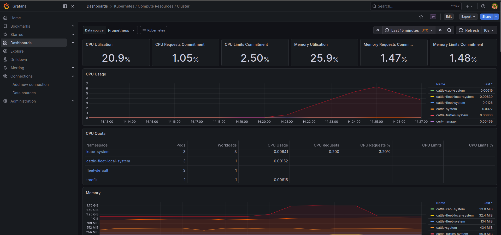

## Overview

This repository provides a high-level overview of my personal homelab environment, created to develop practical skills in Linux system administration, networking, and container orchestration.

The lab is built on Proxmox VE hosts and a k3s Kubernetes cluster. It serves primarily as a learning platform, while also functioning as a home media server and VPN gateway.

The goal of this project is to explore self-hosting, improve infrastructure management skills, and work towards greater digital independence.

## Table of Contents
1. [Overview](#overview)
2. [Infrastructure](#infrastructure)
3. [Networking](#networking)
4. [Kubernetes (k3s)](#kubernetes-k3s)
5. [Services](#services)
6. [Storage](#storage)
7. [Security](#security)
8. [Future Tools](#future-tools)
9. [Notes](#notes)

## Infrastructure

The homelab is built on two physical nodes:

- **ASUS (legacy desktop hardware)**
- **DELL T410 (server-grade hardware)**

Both machines are running Proxmox VE and are configured in a clustered setup, enabling centralized management and resource distribution across nodes.

*Proxmox VE UI showcasing the cluster setup*

## Networking

The homelab network is managed using a virtualized **pfSense** instance, which acts as the primary gateway and VPN server for the environment. pfSense ensures secure and efficient routing between VLANs and controls access to different services in the lab.

The network is segmented into the following VLANs:

- **VLAN10** – Default user network, with external access to services exposed via **Traefik**.
- **VLAN99** – Internal management network, hosting infrastructure components such as virtual machines and dashboards.
- **VLAN20** – WireGuard VPN network, enabling secure remote access for VPN clients to the homelab environment.

### Network Diagram

Below is a diagram illustrating the homelab's network architecture, showcasing how different VLANs and services interact:

  
*Diagram showing the segmentation of the network and Traefik routing traffic to the Kubernetes cluster.*

### Service Access and Routing

- **Traefik** acts as the **reverse proxy** and **ingress controller**, routing incoming traffic to appropriate services running within the environment. It exposes services over HTTPS using **cert-manager** for automated TLS certificate management.
- All services that require external access are routed through **Traefik**, ensuring that traffic is securely handled and appropriately directed to the right service, whether it’s a web application, media server, or dashboard.

### VPN Setup

- **WireGuard** is configured within **VLAN20** to provide secure remote access to the homelab via VPN. This allows external clients to connect to the homelab securely and access internal resources as though they are part of the local network.

## Kubernetes (k3s)

The container orchestration layer is built using a k3s Kubernetes cluster deployed on virtual machines provisioned with Cloud-Init (Ubuntu Server), allowing consistent configuration and basic system hardening.

The cluster consists of:
- **1 master node**
- **4 worker nodes**

High availability at the physical layer is limited due to hardware constraints, but clustering is implemented at the virtualization level.

An **admin VM** is used as a management node, providing:
- Access to `kubectl` for cluster administration
- Storage for Kubernetes manifests (YAML) and configuration files

Workloads are deployed using a combination of:
- **kubectl** with YAML manifests for direct resource management
- **Helm** for more complex or packaged applications

**Monitoring** is set up using **Prometheus** and **Grafana** for visualizing metrics collected from the cluster, allowing me to track resource usage and performance in real time.

  
*Grafana dashboard visualizing Kubernetes metrics*

## Services

The homelab hosts a range of self-managed services deployed within the Kubernetes cluster:

- **Rancher** – Kubernetes management platform
- **Traefik** – Reverse proxy and ingress controller
- **cert-manager** – Automated TLS certificate management (all services are exposed over HTTPS)
- **Jellyfin** – Media streaming server
- **Media automation stack** – Automated media management and organization
- **Prometheus** – Monitoring system collecting metrics from Kubernetes and infrastructure
- **Grafana** – Visualization platform for Prometheus metrics and other data sources

All externally accessible services are routed through Traefik and secured using TLS certificates managed by cert-manager.

Example configurations for selected services can be found in the [`configs/`](./configs) directory.

## Storage

Storage is managed using an OpenMediaVault virtual machine, backed by an array of 6 × 2TB drives.

This solution was chosen to provide a flexible and dedicated storage layer, independent of the Kubernetes cluster. By separating storage from the orchestration layer, it allows for easier management of data, shares, and permissions without being tightly coupled to k3s-specific storage solutions.

OpenMediaVault enables:
- Centralized management of storage resources
- Support for network file sharing (e.g. NFS/SMB)
- Greater control over data organization and access

This approach offers more versatility compared to purely Kubernetes-oriented storage solutions, making it better suited for a mixed-use homelab environment (infrastructure + media services).

## Security

Basic security practices are implemented across the homelab environment:

- **Network security** – Firewall rules are configured in pfSense to control traffic between VLANs and restrict unnecessary access
- **Backups** – Virtual machines are backed up using Proxmox snapshots, following a 3-2-1 backup strategy
- **SSH hardening** – Secure access is enforced through basic SSH configuration practices
- **Intrusion prevention** – Fail2ban is used to protect services from brute-force attacks

These measures provide a foundational level of security while maintaining flexibility for further improvements.

## Future Tools

I am working towards implementing the following tools to enhance my homelab's functionality and automation:

- **GitOps**: Managing Kubernetes deployments and infrastructure with Git, aiming for a more automated, version-controlled workflow.
- **ArgoCD**: Continuous delivery tool for automating application deployments to Kubernetes clusters.
- **Terraform**: Infrastructure as code (IaC) for automating the provisioning and management of cloud and on-premise resources.

These tools will improve the management and scalability of my infrastructure and align with industry best practices for DevOps and cloud-native workflows.

## Notes

This repository showcases selected parts of a real homelab environment, adapted and simplified to highlight key concepts in Linux administration, networking, and Kubernetes.

---

Thank you for reviewing this project.